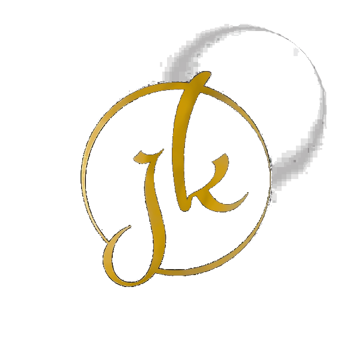
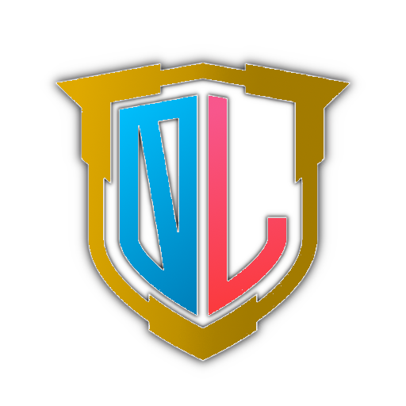
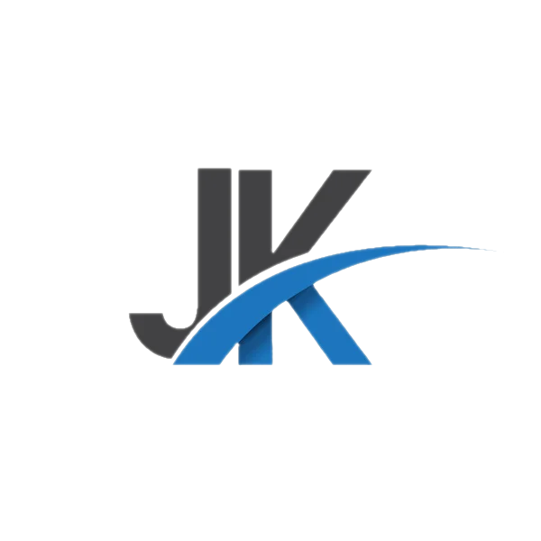
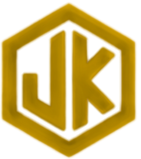
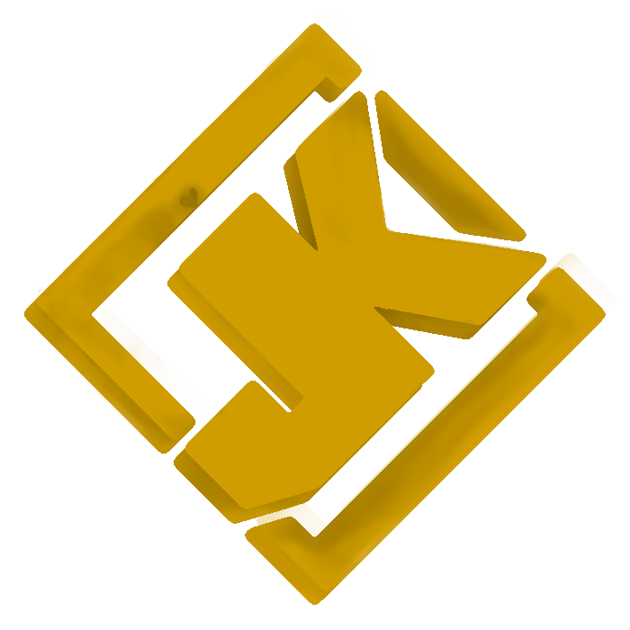
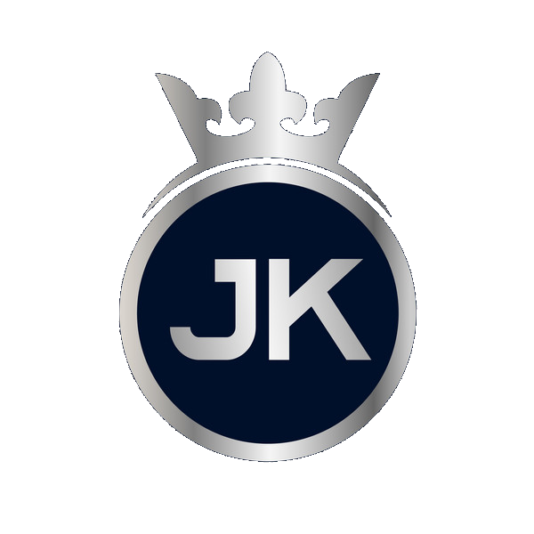
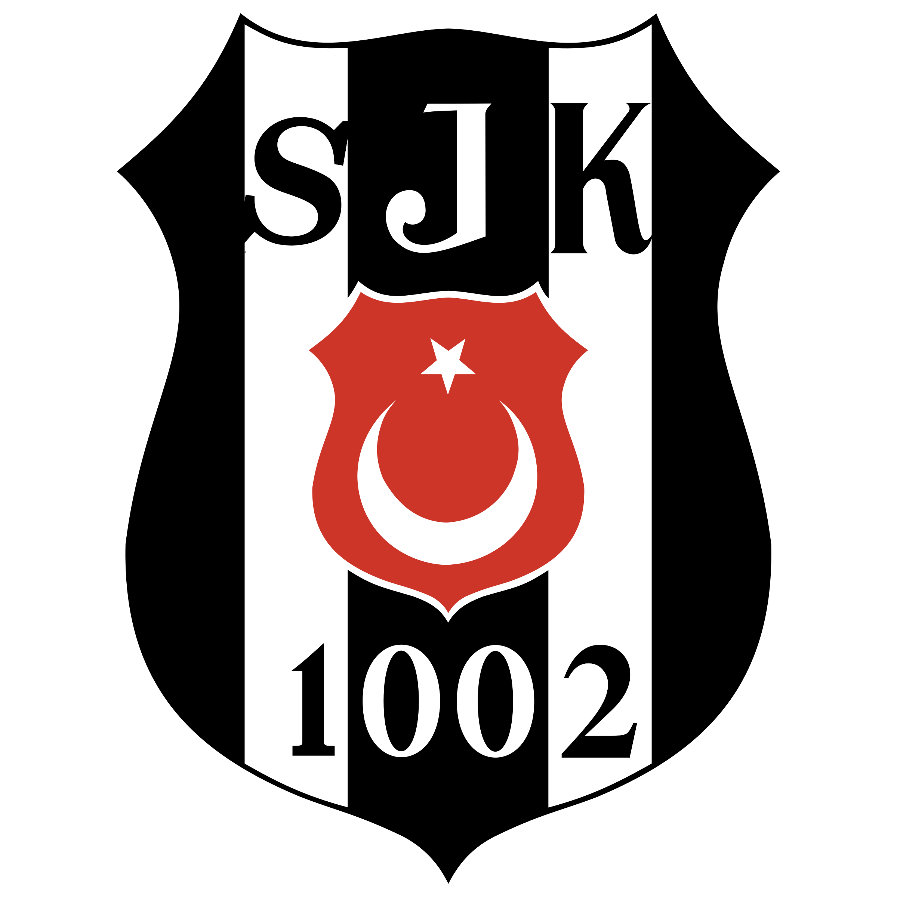

# WELCOME! 
## Hi, I'm Meldencio Czarlemagne from Philippines!

### Current projects
#### I recently work on:
* [Ryan and Jezza's Wedding RSVP](https://mczvc-biomew.github.io/ryan-and-jezza/)
  * 

* [Johnella's Website](https://jk-sanjuan.github.io/)
  * Online Shop
    * 
  * Clinic
  * Blog
  * [+] More
    * 
* [Bayanihan OpenLibrary](https://mczvc-biomew.github.io/)
  * Bayanihan College
  * Bayanihan Publishing
* [One Language - Bayanihan Project](https://github.com/mczvc-biomew/OneLang)
  * One Language, One Learning 

  

  
  
  
  
  

  

  
  
  
  

  

  
  
  
  

  

  
  
  
  

  

  
  
  
  

  

  
  
  

<h2>Resume of Czarlemagne</h2>

  

    

<b>Meldencio Czarlemagne</b>
 Corrales

    
  

  

    
Software Engineer and Architect, DevOps Engineer, Database Manager and Administrator,  
  IT & IS Manager

    

      
        🏠 St. Peter, New Era, Quezon City  
        📞 (+63) 960 205 6160 📞 (+63) 954 276 9143  
        📧 mczvc.biomew@gmail.com 📧 mczvc@proton.me  
      
    

  

  

    <h3>ABOUT ME</h3>
    

      <h4>I am a Filipino software architect who currently lives in Quezon City.</h4>
      
With a college degree in Computer Science, over 7 years of experience as Backend developer / Full-stack developer, I am passionate about working on challenging projects that allow me to grow professionally.

      <h4>Adaptable</h4>
      
While my expertise lies in Backend and Full-stack development, I stay up to date with the latest trends in Frontend and other areas, using my free time to expand my knowledge.

      <h4>Looking for ways to automate tasks</h4>
      
Always trying to have everything automated. I don't like repetitive tasks so my software designs normally would come with the idea of minimizing the number of tasks needed to maintain or add new functionalities. My software designs prioritize efficiency, aiming to reduce maintenance and enhance scalability, ensuring long-term value and optimization.

      <h4>Tech-Savvy</h4>
      
I stay current with emerging technologies and actively seek ways to apply them in real-world projects.

      <h4>Continuous Improvement</h4>
      
I’m never satisfied with just solving a problem; I’m always on the lookout for better, more efficient solutions. I won't settle just by solving the problem and I am always struggling to find a better way to do it.

      <h4>Motivations</h4>
      <ul>
        <li>A challenging environment that fosters growth.</li>
        <li>Opportunities to work with diverse technologies.</li>
        <li>Freedom to optimize my workspace and processes for maximum productivity.</li>
      </ul>
      <h4>Hobbies</h4>
      <ul>
        <li>Problem-solving and thinking creatively</li>
        <li>Exploring software development</li>
        <li>Enjoying music</li>
        <li>Fixing devices</li>
        <li>Breaking free from the routine</li>
      </ul>
    

    <h3>PROFILE</h3>
    

     
Results-driven software developer with extensive experience in both systems and business domain programming languages (C, C++, C#, Java) and (Python, JavaScript, Ruby, Typescript), leveraging expertise and proficiency in wide variety of frameworks for these languages, for example: Python (flask, Django, Pandas, Numpy), Java Spring, Ruby on Rails, Javascript (NextJS, ReactJS, AngularJS, VueJS), C++ (Boost, Qt5, and OpenGL graphics library), delivering high-quality and innovative solutions across multiple platforms.

     
Strong foundation and solid grasp in algorithms, data-structures, and mathematics, with proficiency in TDD and safety assurance, ensuring code quality and functionality of tested software, in compliance to specifications and use cases of software; applied to, and worked for Distributed, High-performance, and Scientific Computing. 

     
I am experienced in technical and team leadership: As a seasoned technical leader, I excel and bring expertise in software design, leveraging in deployment automation to improve and optimize the CI/CD pipelines; commend testing frameworks to the team; and playing the role of designing and operating mission critical services in a cloud-based architecture — I effectively guide cross-functional teams and drive project and business to success — delivering high-quality and efficient, scalable software solutions. 

     
Polyglot to familiarize programming in 15+ languages, which includes: Bash, Perl, Powershell, Ruby, Clojure, Haskell, Julia, Go, Kotlin, Swift, Lua, Rust, Zig, Assembly, SQL, Typescript. 

      
As a software architect and database manager, I am proficient in designing API, software architecture, and cloud-based services, providing solutions in building effective, efficient, and robust software. 

     
Mastered and practiced clean code principles and Design Patterns for 10+ years; pragmatic, and highly accomplished practitioner of agile methodology such as Scrum, Lean, XP, and crystal.

     
As a full-stack developer and DevOps engineer with 6+ years of experience, I possess a unique blend of technical expertise, leadership skills, and passion for delivering high-quality software solutions.

    

    <h3>WORK EXPERIENCE</h3>
    

      

        

          (May 2019 – Nov. 2019)
          CEO & Founder, Software Engineer and Architect
           <b>Egg Co. Creations</b> | 
          Quezon City
          <ul class="dashed mt-1 *:mt-2">
            <li>Developed the Easy Graphics, Easy Game, and Easy Animation library using Java and OpenGL.</li>
            <li>Released two Android games using the library.</li>
          </ul>
        

        

          (Dec. 2019 – Present)
          Software Engineer and Architect, 
            Full-stack Developer, DevOps Engineer – R&D, 
            Database Administrator, IT & IS Manager, 
            Business Innovator 
          
            <b>DADS University, Bayanihan College, Network Careers</b>
           | Quezon City
          <ul class="dashed *:mt-2">
            <li>Built several micro-services and API endpoints for the consumers and producers operating in the open-source, MOOC and value-based Careers platform to implement automated management solutions.</li>
            <li>Developed automation tools for document generation.</li>
            <li>Created full-stack web applications for the university’s virtual learning environment.</li>
            <li>Designed a business model for university-wide learning; a balanced and prosperous ecosystem, for not-for-profit design of business.</li>
            <li>Maintained and organized the public and private libraries of colleges: its database, and its distributed access to information, under its IS infrastructure, I have built a managed Library System for Librarians, Students of different departments, Faculty (educators of Business and, Science, Engineering, and Medicine; and to the Members of Royal Society); frontier in seeding the Foundation’s Academic Resources.</li>
            <li>Developed, and maintained business tools used in managerial task; began innovating the solutions for business, work careers, HR workforce, and transformed, with new models of learning environment for a wide audience in a university-wide environment setup.</li>
          </ul>
        

      

    

    <h3>Company</h3>
    

      

        

          Egg Co.(Parent)
        

        

          <ul class="list-disc list-inside [&_ul]:list-[revert] ml-4 [line-height:1.5]">
            <li>DAD System and University – College of Computer Science, School for Business and Management</li>
            <li>Royal Society of Science, Engineering, and Medicine</li>
            <li>Royal Society of Mathematics, Architecture, and Computing</li>
            <li>Royal Society for Professionals</li>
            <li>Bayanihan College, Bayanihan Foundation</li>
              <ul class="list-disc list-inside ml-8">
                <li>United Alumnus Royals</li>
                <li>Bayanihan OS, Software</li>
              </ul>
            <li>Vanguard Consortium</li>
              <ul class="list-disc list-inside ml-8">
                <li>Royal Knighthood</li>
              </ul>
            <li>Egg Co. Club, Egg Co. Hub</li>
            <li>Royal Club™ Machines, Equipments, and Technology</li>
            <li>Picosoft™</li>
          </ul>
        

      

    

  

  

    

      <h3>EDUCATION</h3>
      

        August 2014 – October 2016
        Bachelor of Science in Computer Science
        New Era University
        College of Computer Studies | New Era, Quezon City
        
      

      

        

          <h3>Programming Languages</h3>
          C, C++, C#, Clojure, Carbon, Go, Java, Kotlin, Python, Lua, Haskell, Julia, HTML5 / XML, CSS3, PHP, JavaScript, Typescript, Rust, Ruby, OCaml, Swift, Zig, Assembly, Bash, Powershell, SQL, Solidity, Vyper
        

        <table>
          <h4 class="flex mt-3 *:w-[999px]">
            Computer Languages
          </h4>
          <tr>
            <td>C  
                  💗💗💗💗💗  
                  C++  
                  💗💗💗💗💗  
                  C#  
                  💛💛💛💛💛  
                  Rust  
                  💜💜💜💜🖤</td>
            <td>Javascript  
                  💝💝💝💝💝  
                  Go  
                  💚💚💚💚🖤  
                  Java  
                  💙💙💙💙💙  
                  Swift  
                  💞💞💞🖤🖤</td>
            <td>Python (with Django)  
                  💚💚💚💚💚  
                  LUA  
                  💚💚💚💚💚  
                  PHP  
                  💚💚💚🖤🖤  
                  Ruby  
                  💚💚💚🖤🖤</td>
            <td>HTML5  
                  💙💙💙💙💙  
                  CSS3  
                  💚💚💚💚💚  
                  SQL  
                  💜💜💜💜💜  
                  Carbon  
                  💜💜💜💜🖤</td>
          </tr>
        </table>
        

          <h3>Frameworks and Libraries</h3>
          Django, Flask, VueJS, ReactJS, AngularJS, NextJS, Webpack, ExpressJS, OpenAPI, Polymer, Redis, NodeJS, Deno, Bun, Electron, Bootstrap, TailwindCSS, Bulma, Boost, Rails, Qt5, Kafka, jOOQ, Spring, Rails, Scipy, beautifulsoup4, Kivy, Pandas, Numpy, OpenGL
        

        

          <h3>Tools & Technologies</h3>
          Docker, Kubernetes, Oracle, PostgreSQL, MySQL, MongoDB, GraphQL, Postman, Selenium, Nginx, Git, Apache, Jira, CMake, CLion, IntelliJ, VS Code, Linux, Ansible, Chef, Terraform, IBM Control Desk, Vivantio, Firebase, Elasticsearch, Logstash, Kibana, Salesforce, SAP, Heroku, AWS
        

        

          <h3>Methodologies</h3>
          Pragmatism, ArchOps, Waterfall, SRE: Site Reliability Engineering, DevOps (CI/CD, dynamic testing, Infrastructure as Code, CCA: Continuous Configuration Automation), TPS: Transaction Processing System (Kaizen, Continuous Improvement, OLTP: Online Transaction Processing), Agile (Scrum, Lean, XP, Crystal), Twelve-Factor App (SaaS, PaaS), DevSecOps (DAST, PSS ISE, Security by Design, Security Automation), DataOps
          
        

      

      

          <h3>Organizations</h3>
          <ul>
          <li class="flex mb-4">
            Royal Academies of Science, Engineering, and Medicine
            Software Architect, 2022–2032
          </li>
          <li class="flex mb-4">
            Vanguard Consortium – Phi Chi Alpha
            

              Royal Knight, Sigma Alpha,  Founder
              Established on 14 Dec. 2023
            

          </li>
          <li class="flex mb-4">
            Linux Foundation
          </li>
          <li class="flex mb-4">
            CompTIA
          </li>
        </ul>
      

      

        

          <h3>Database</h3>
          MySQL, SQLite, PostgreSQL, MongoDB
        

        

          <h3>Operating Systems</h3>
          Windows, Linux (OpenBSD, Ubuntu, CentOS, Redhat), Android
        

        

          <h3>Software and Tools</h3>
          Git, Cmake, VS Code, Docker, Eclipse, NodeJS, LAMP, Jetbrains (CLion, IntelliJ, PyCharm), Jira
        

        

          <h3>Coursework Information</h3>
          <table id="coursework" class="w-[725px] block *:bg-gray-500 *:text-white *:p-1 [line-height:2.1]
                       *:cursor-pointer">
                <tr>
                  <td>Calculus I, II</td> <td>English Composition I, II</td> 
                  <td>Interpersonal Communication Skills</td> <td>Reasoning & Argumentation</td> 
                  <td>Computation in Physical Sciences</td> <td>Discrete Mathematics</td> 
                  <td class="asterisked">Concrete Mathematics *</td> <td>Logic & Mathematical Reasoning</td> 
                  <td>Distributed Systems</td> <td>Parallel and Distributed Algorithms</td> 
                  <td class="asterisked">Algorithms-I *</td> <td>Algorithms-II</td> <td>Database and Web System Development</td> 
                  <td>Computer Organization & Architecture</td> <td>Computer Networks</td>
                  <td>Networks and Data Communications</td> <td class="asterisked">Statistics *</td> 
                  <td>Formal Language and Automata Theory</td> <td class="asterisked">Software Engineering *</td> 
                  <td>Software Engineering for Data Scientists</td> <td>Programming Languages</td> 
                  <td>Software Architecture</td> <td class="asterisked">Software Design *</td> 
                  <td class="asterisked">Operating Systems *</td> <td class="asterisked">Database Management Systems *</td> 
                  <td>Speech and Natural Language Processing</td> <td>Ethical and Secure Computing</td> 
                  <td>Machine Learning</td> <td>Breadth Life Science</td>
                  <td>High Performance Computing & Computer Architecture</td>
                  <td>Computational Science and Engineering</td> 
                  <td class="asterisked">MATLAB * for Engineering and the Life Sciences</td> 
                  <td class="asterisked">Graphics and Computer Vision * + Image Processing</td> 
                  <td>Graphics Programming with OpenGL</td> 
                  <td class="asterisked">Network Science *</td> 
                  <td>Social Computing</td> <td>Discrete Structures</td> 
                  <td class="asterisked">Cryptography *</td> <td class="asterisked">Blockchain Technologies *</td> 
                  <td class="asterisked">Cloud Computing *</td> <td class="asterisked">Artificial Intelligence *</td> 
                  <td>Symbolic Logic</td> <td>ERGU | EREG</td> 
                  <td>Rizal</td>
                </tr>
          </table>
          
            
              (* Coursework had a lab component as well)
        

      

    

  

